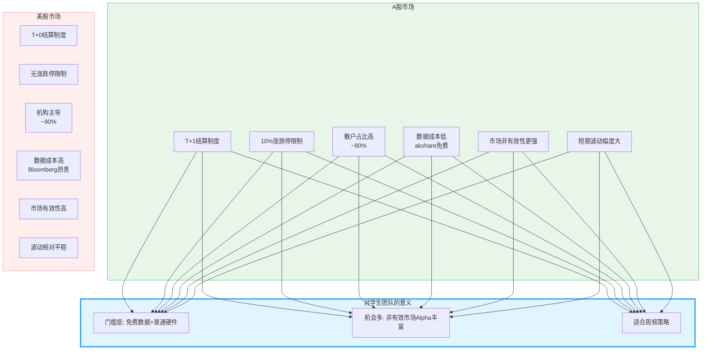
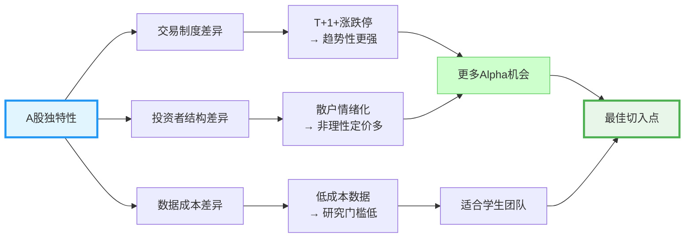

# 第4页：A股市场独特性对比

## 图1：A股vs美股交易制度对比

```mermaid
graph TD
    subgraph A股["A股市场"]
        A1[T+1结算制度]
        A2[10%涨跌停限制]
        A3[散户占比高<br/>~60%]
        A4[数据成本低<br/>akshare免费]
        A5[市场非有效性更强]
        A6[短期波动幅度大]
    end
    
    subgraph 美股["美股市场"]
        B1[T+0结算制度]
        B2[无涨跌停限制]
        B3[机构主导<br/>~90%]
        B4[数据成本高<br/>Bloomberg昂贵]
        B5[市场有效性高]
        B6[波动相对平稳]
    end
    
    subgraph 结论["对学生团队的意义"]
        C1[门槛低: 免费数据+普通硬件]
        C2[机会多: 非有效市场Alpha丰富]
        C3[适合周频策略]
    end
    
    A1 & A2 & A3 & A4 & A5 & A6 --> C1 & C2 & C3
    
    style A股 fill:#e8f5e9,stroke:#4CAF50
    style 美股 fill:#ffeeee,stroke:#ff9999
    style 结论 fill:#e1f5ff,stroke:#2196F3,stroke-width:3px
```

## 图2：A股独特性的量化价值

```mermaid
graph LR
    A[A股独特性] --> B[交易制度差异]
    A --> C[投资者结构差异]
    A --> D[数据成本差异]
    
    B --> B1[T+1+涨跌停<br/>→ 趋势性更强]
    C --> C1[散户情绪化<br/>→ 非理性定价多]
    D --> D1[低成本数据<br/>→ 研究门槛低]
    
    B1 & C1 --> E[更多Alpha机会]
    D1 --> F[适合学生团队]
    E & F --> G[最佳切入点]
    
    style A fill:#e1f5ff,stroke:#2196F3,stroke-width:3px
    style E fill:#ccffcc,stroke:#66cc66
    style G fill:#e8f5e9,stroke:#4CAF50,stroke-width:3px
```
