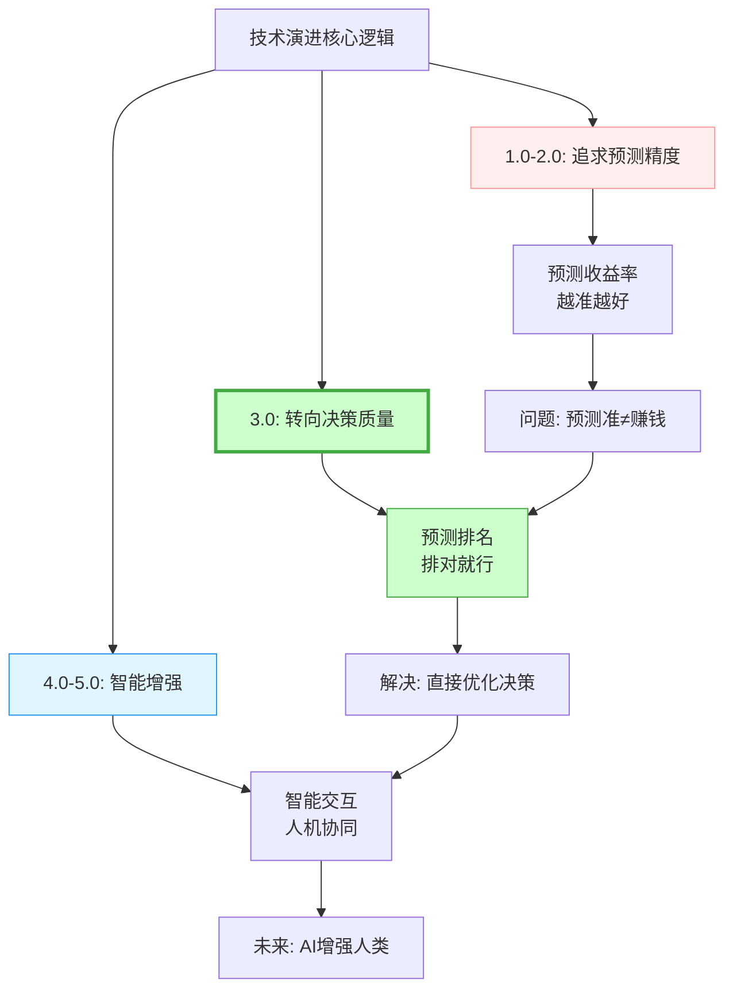
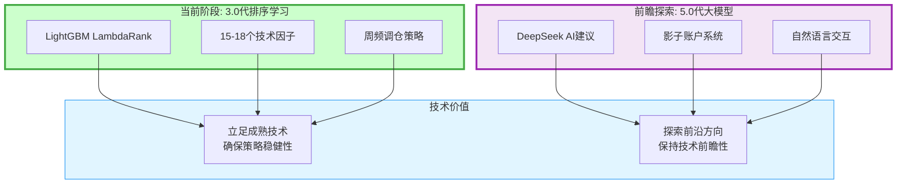

# 第6页：五代技术演进路线图

## 图1：五代技术演进时间线

```mermaid
graph LR
    subgraph 1.0["1.0 线性模型<br/>1960s-1980s"]
        A1[CAPM]
        A2[OLS回归]
        A3[解决基础定价]
    end
    
    subgraph 2.0["2.0 树模型<br/>1990s-2000s"]
        B1[GBDT]
        B2[XGBoost]
        B3[解决非线性关系]
    end
    
    subgraph 3.0["3.0 排序学习<br/>2000s-2010s"]
        C1[LambdaRank]
        C2[LambdaMART]
        C3[解决决策质量]
    end
    
    subgraph 4.0["4.0 深度学习<br/>2010s-2020s"]
        D1[LSTM]
        D2[Transformer]
        D3[自动特征提取]
    end
    
    subgraph 5.0["5.0 大模型+RL<br/>2020s-至今"]
        E1[GPT]
        E2[PPO]
        E3[人机协同]
    end
    
    1.0 --> 2.0 --> 3.0 --> 4.0 --> 5.0
    
    style 1.0 fill:#eeeeee,stroke:#999999
    style 2.0 fill:#eeeeee,stroke:#999999
    style 3.0 fill:#ccffcc,stroke:#44aa44,stroke-width:4px
    style 4.0 fill:#eeeeee,stroke:#999999
    style 5.0 fill:#e1f5ff,stroke:#2196F3,stroke-width:3px
```

## 图2：从预测精度到决策质量

```mermaid
graph TD
    A[技术演进核心逻辑] --> B[1.0-2.0: 追求预测精度]
    A --> C[3.0: 转向决策质量]
    A --> D[4.0-5.0: 智能增强]
    
    B --> B1[预测收益率<br/>越准越好]
    C --> C1[预测排名<br/>排对就行]
    D --> D1[智能交互<br/>人机协同]
    
    B1 --> E[问题: 预测准≠赚钱]
    C1 --> F[解决: 直接优化决策]
    D1 --> G[未来: AI增强人类]
    
    E --> C1
    F --> D1
    
    style B fill:#ffeeee,stroke:#ff9999
    style C fill:#ccffcc,stroke:#44aa44,stroke-width:3px
    style D fill:#e1f5ff,stroke:#2196F3
    style C1 fill:#ccffcc,stroke:#44aa44
```

## 图3：我们的技术定位

```mermaid
graph TD
    subgraph 当前["当前阶段: 3.0代排序学习"]
        C1[LightGBM LambdaRank]
        C2[15-18个技术因子]
        C3[周频调仓策略]
    end
    
    subgraph 前瞻["前瞻探索: 5.0代大模型"]
        F1[DeepSeek AI建议]
        F2[影子账户系统]
        F3[自然语言交互]
    end
    
    subgraph 价值["技术价值"]
        V1[立足成熟技术<br/>确保策略稳健性]
        V2[探索前沿方向<br/>保持技术前瞻性]
    end
    
    C1 & C2 & C3 --> V1
    F1 & F2 & F3 --> V2
    
    style 当前 fill:#ccffcc,stroke:#44aa44,stroke-width:3px
    style 前瞻 fill:#f3e5f5,stroke:#9C27B0,stroke-width:3px
    style 价值 fill:#e1f5ff,stroke:#2196F3
```
