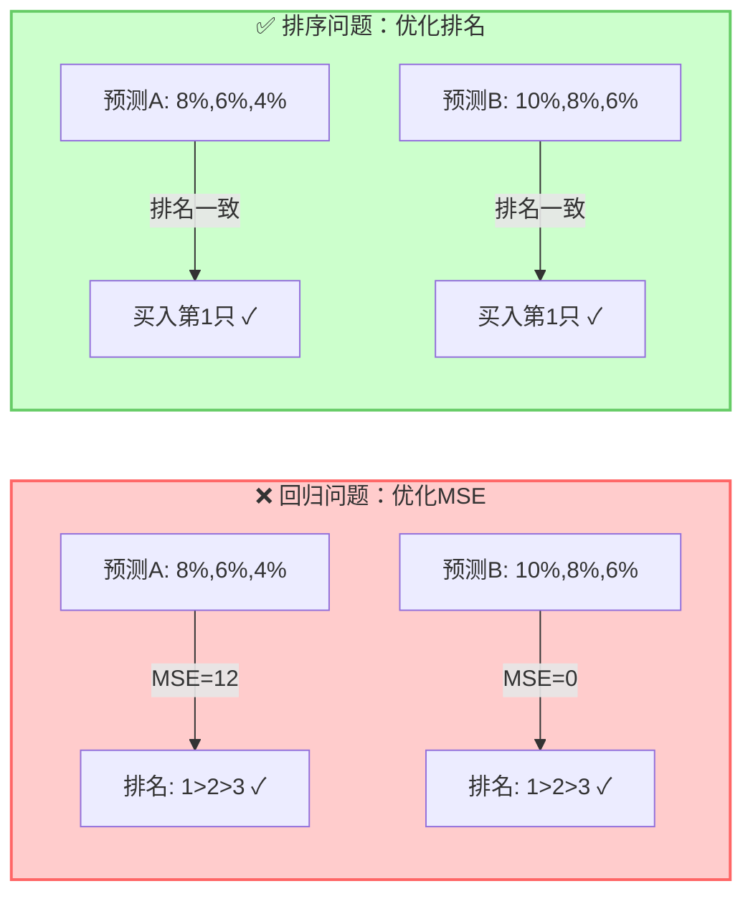
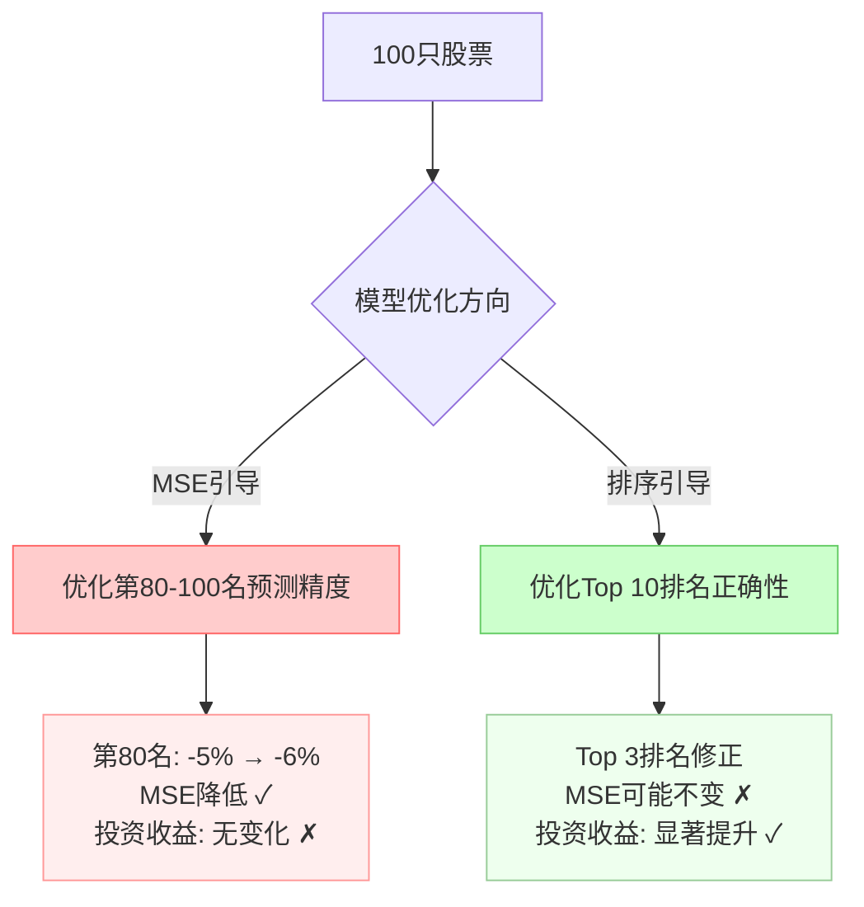

# 第7页：MSE vs 排序目标对比图

## 图1：核心矛盾对比

```mermaid
graph LR
    subgraph 回归问题["❌ 回归问题：优化MSE"]
        A1[预测A: 8%,6%,4%] -->|MSE=12| B1[排名: 1>2>3 ✓]
        A2[预测B: 10%,8%,6%] -->|MSE=0| B2[排名: 1>2>3 ✓]
    end
    
    subgraph 排序问题["✅ 排序问题：优化排名"]
        C1[预测A: 8%,6%,4%] -->|排名一致| D1[买入第1只 ✓]
        C2[预测B: 10%,8%,6%] -->|排名一致| D2[买入第1只 ✓]
    end
    
    style 回归问题 fill:#ffcccc,stroke:#ff6666,stroke-width:2px
    style 排序问题 fill:#ccffcc,stroke:#66cc66,stroke-width:2px
```

## 图2：MSE的误导性

```mermaid
graph TD
    A[100只股票] --> B{模型优化方向}
    B -->|MSE引导| C[优化第80-100名预测精度]
    B -->|排序引导| D[优化Top 10排名正确性]
    
    C --> E[第80名: -5% → -6%<br/>MSE降低 ✓<br/>投资收益: 无变化 ✗]
    D --> F[Top 3排名修正<br/>MSE可能不变 ✗<br/>投资收益: 显著提升 ✓]
    
    style C fill:#ffcccc,stroke:#ff6666
    style D fill:#ccffcc,stroke:#66cc66
    style E fill:#ffeeee,stroke:#ff9999
    style F fill:#eeffee,stroke:#99cc99
```
