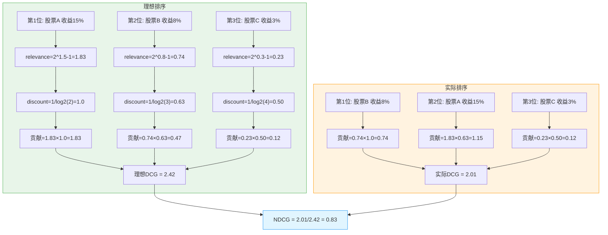
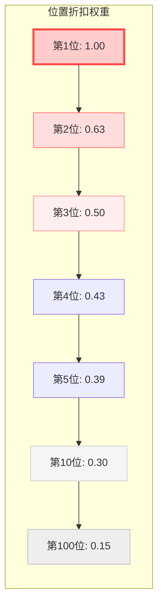

# 第8页：NDCG完整计算过程

## 图1：NDCG计算流程

```mermaid
graph LR
    A[股票列表] --> B[Step1: 相关性加权]
    B --> C[Step2: 位置折扣]
    C --> D[Step3: 累积DCG]
    D --> E[Step4: 归一化NDCG]
    
    style A fill:#e1f5ff,stroke:#2196F3
    style B fill:#fff3e0,stroke:#FF9800
    style C fill:#fff3e0,stroke:#FF9800
    style D fill:#fff3e0,stroke:#FF9800
    style E fill:#e8f5e9,stroke:#4CAF50
```

## 图2：具体计算示例

```mermaid
graph TD
    subgraph 理想排序["理想排序"]
        I1["第1位: 股票A 收益15%"] --> I2["relevance=2^1.5-1=1.83"]
        I2 --> I3["discount=1/log2(2)=1.0"]
        I3 --> I4["贡献=1.83×1.0=1.83"]
        
        I5["第2位: 股票B 收益8%"] --> I6["relevance=2^0.8-1=0.74"]
        I6 --> I7["discount=1/log2(3)=0.63"]
        I7 --> I8["贡献=0.74×0.63=0.47"]
        
        I9["第3位: 股票C 收益3%"] --> I10["relevance=2^0.3-1=0.23"]
        I10 --> I11["discount=1/log2(4)=0.50"]
        I11 --> I12["贡献=0.23×0.50=0.12"]
        
        I4 & I8 & I12 --> I13["理想DCG = 2.42"]
    end
    
    subgraph 实际排序["实际排序"]
        A1["第1位: 股票B 收益8%"] --> A2["贡献=0.74×1.0=0.74"]
        A3["第2位: 股票A 收益15%"] --> A4["贡献=1.83×0.63=1.15"]
        A5["第3位: 股票C 收益3%"] --> A6["贡献=0.23×0.50=0.12"]
        A2 & A4 & A6 --> A7["实际DCG = 2.01"]
    end
    
    I13 & A7 --> R["NDCG = 2.01/2.42 = 0.83"]
    
    style 理想排序 fill:#e8f5e9,stroke:#4CAF50
    style 实际排序 fill:#fff3e0,stroke:#FF9800
    style R fill:#e1f5ff,stroke:#2196F3
```

## 图3：位置折扣可视化

```mermaid
graph LR
    subgraph 位置权重["位置折扣权重"]
        direction TB
        P1["第1位: 1.00"] 
        P2["第2位: 0.63"]
        P3["第3位: 0.50"]
        P4["第4位: 0.43"]
        P5["第5位: 0.39"]
        P10["第10位: 0.30"]
        P100["第100位: 0.15"]
    end
    
    P1 --> P2 --> P3 --> P4 --> P5 --> P10 --> P100
    
    style P1 fill:#ffcccc,stroke:#ff4444,stroke-width:3px
    style P2 fill:#ffdddd,stroke:#ff6666
    style P3 fill:#ffeeee,stroke:#ff8888
    style P10 fill:#f5f5f5,stroke:#cccccc
    style P100 fill:#eeeeee,stroke:#bbbbbb
```
