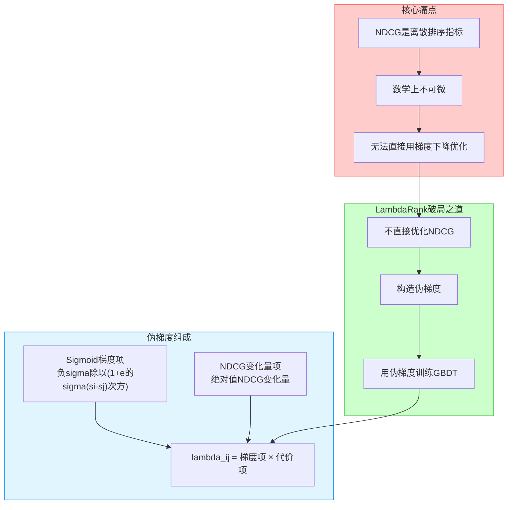
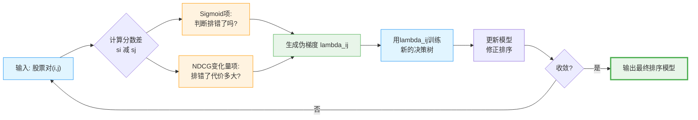

# 第9页：LambdaRank原理流程图

## 图1：LambdaRank核心思想

```mermaid
graph TD
    subgraph 问题["核心痛点"]
        P1[NDCG是离散排序指标] --> P2[数学上不可微]
        P2 --> P3[无法直接用梯度下降优化]
    end
    
    subgraph 解决方案["LambdaRank破局之道"]
        S1[不直接优化NDCG] --> S2[构造伪梯度]
        S2 --> S3[用伪梯度训练GBDT]
    end
    
    subgraph 伪梯度公式["伪梯度组成"]
        direction TB
        G1["Sigmoid梯度项<br/>负sigma除以(1+e的sigma(si-sj)次方)"] --> G3["lambda_ij = 梯度项 × 代价项"]
        G2["NDCG变化量项<br/>绝对值NDCG变化量"] --> G3
    end
    
    P3 --> S1
    S3 --> G3
    
    style 问题 fill:#ffcccc,stroke:#ff6666
    style 解决方案 fill:#ccffcc,stroke:#66cc66
    style 伪梯度公式 fill:#e1f5ff,stroke:#2196F3
```

## 图2：LambdaRank训练流程

```mermaid
graph LR
    A["输入: 股票对(i,j)"] --> B{"计算分数差<br/>si 减 sj"}
    B --> C["Sigmoid项:<br/>判断排错了吗?"]
    B --> D["NDCG变化量项:<br/>排错了代价多大?"]
    C --> E["生成伪梯度 lambda_ij"]
    D --> E
    E --> F["用lambda_ij训练<br/>新的决策树"]
    F --> G["更新模型<br/>修正排序"]
    G --> H{"收敛?"}
    H -->|否| A
    H -->|是| I["输出最终排序模型"]
    
    style A fill:#e1f5ff,stroke:#2196F3
    style C fill:#fff3e0,stroke:#FF9800
    style D fill:#fff3e0,stroke:#FF9800
    style E fill:#e8f5e9,stroke:#4CAF50
    style F fill:#e1f5ff,stroke:#2196F3
    style I fill:#e8f5e9,stroke:#4CAF50,stroke-width:3px
```
