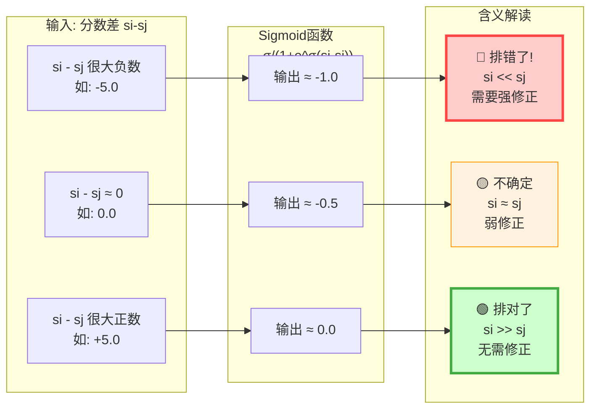
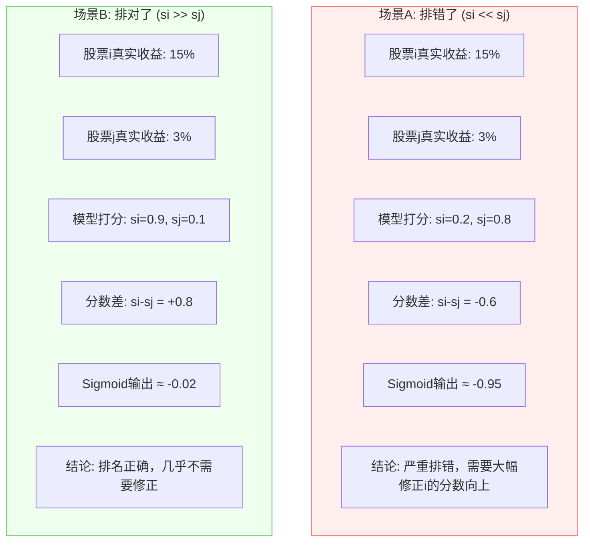

# 第10页：Sigmoid梯度项详解

## 图1：Sigmoid作为错误检测器

```mermaid
graph LR
    subgraph 输入["输入: 分数差 si-sj"]
        I1[si - sj 很大负数<br/>如: -5.0]
        I2[si - sj ≈ 0<br/>如: 0.0]
        I3[si - sj 很大正数<br/>如: +5.0]
    end
    
    subgraph Sigmoid["Sigmoid函数<br/>-σ/(1+e^σ(si-sj))"]
        S1[输出 ≈ -1.0]
        S2[输出 ≈ -0.5]
        S3[输出 ≈ 0.0]
    end
    
    subgraph 含义["含义解读"]
        M1[🔴 排错了!<br/>si << sj<br/>需要强修正]
        M2[🟡 不确定<br/>si ≈ sj<br/>弱修正]
        M3[🟢 排对了<br/>si >> sj<br/>无需修正]
    end
    
    I1 --> S1 --> M1
    I2 --> S2 --> M2
    I3 --> S3 --> M3
    
    style M1 fill:#ffcccc,stroke:#ff4444,stroke-width:3px
    style M2 fill:#fff3e0,stroke:#FF9800
    style M3 fill:#ccffcc,stroke:#44aa44,stroke-width:3px
```

## 图2：排序场景映射

```mermaid
graph TD
    subgraph 场景A["场景A: 排错了 (si << sj)"]
        A1[股票i真实收益: 15%] 
        A2[股票j真实收益: 3%]
        A3[模型打分: si=0.2, sj=0.8]
        A4[分数差: si-sj = -0.6]
        A5[Sigmoid输出 ≈ -0.95]
        A6[结论: 严重排错，需要大幅修正i的分数向上]
    end
    
    subgraph 场景B["场景B: 排对了 (si >> sj)"]
        B1[股票i真实收益: 15%]
        B2[股票j真实收益: 3%]
        B3[模型打分: si=0.9, sj=0.1]
        B4[分数差: si-sj = +0.8]
        B5[Sigmoid输出 ≈ -0.02]
        B6[结论: 排名正确，几乎不需要修正]
    end
    
    style 场景A fill:#ffeeee,stroke:#ff6666
    style 场景B fill:#eeffee,stroke:#66cc66
```
