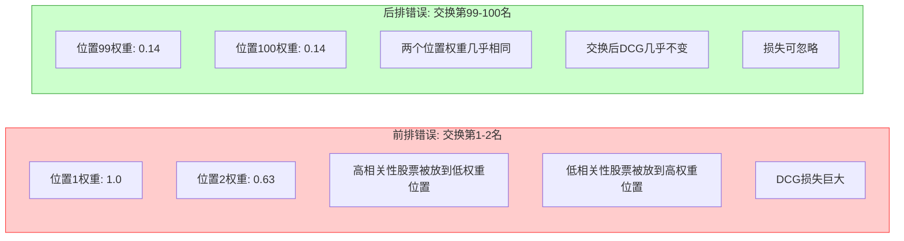
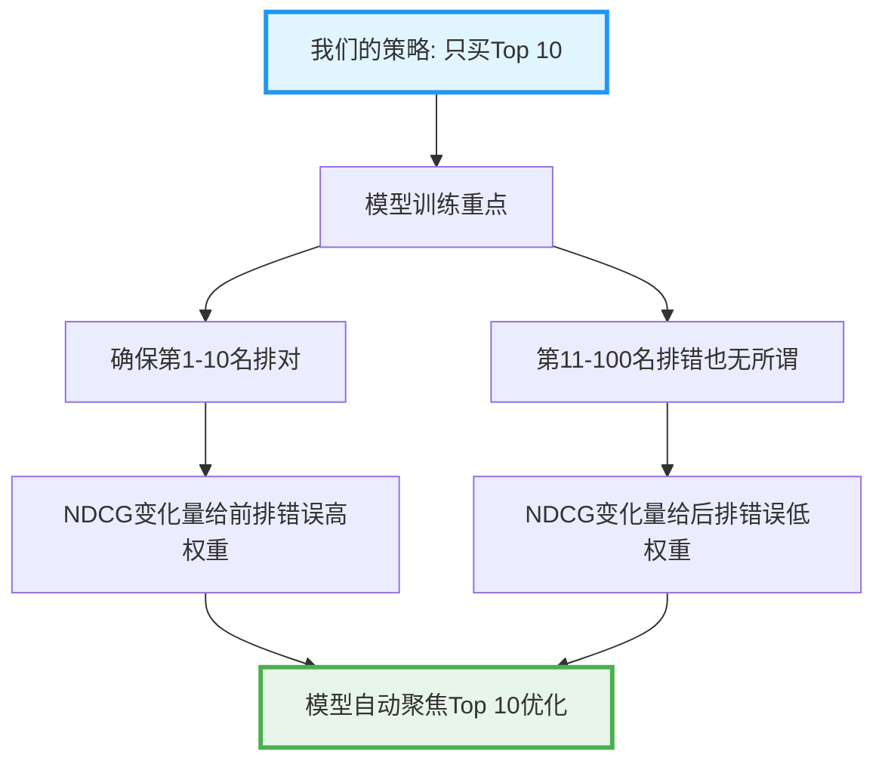

# 第11页：NDCG变化量——排错了代价多大？

## 图1：位置敏感性对比

```mermaid
graph TD
    subgraph 场景A["场景A: 交换第1名和第2名"]
        A1["理想排序: A,B,C,D,..."]
        A2["实际排序: B,A,C,D,..."]
        A3["NDCG变化: 大幅下降"]
        A4["错误代价: 极高"]
        A5["修正优先级: 最高"]
        
        A1 --> A2 --> A3 --> A4 --> A5
    end
    
    subgraph 场景B["场景B: 交换第99名和第100名"]
        B1["理想排序: ...,X,Y"]
        B2["实际排序: ...,Y,X"]
        B3["NDCG变化: 几乎不变"]
        B4["错误代价: 极低"]
        B5["修正优先级: 最低"]
        
        B1 --> B2 --> B3 --> B4 --> B5
    end
    
    style 场景A fill:#ffcccc,stroke:#ff4444
    style 场景B fill:#ccffcc,stroke:#44aa44
```

## 图2：代价计算原理

```mermaid
graph LR
    subgraph 前排错误["前排错误: 交换第1-2名"]
        F1["位置1权重: 1.0"] 
        F2["位置2权重: 0.63"]
        F3["高相关性股票被放到低权重位置"]
        F4["低相关性股票被放到高权重位置"]
        F5["DCG损失巨大"]
    end
    
    subgraph 后排错误["后排错误: 交换第99-100名"]
        R1["位置99权重: 0.14"]
        R2["位置100权重: 0.14"]
        R3["两个位置权重几乎相同"]
        R4["交换后DCG几乎不变"]
        R5["损失可忽略"]
    end
    
    style 前排错误 fill:#ffcccc,stroke:#ff4444
    style 后排错误 fill:#ccffcc,stroke:#44aa44
```

## 图3：与选股策略的契合

```mermaid
graph TD
    A["我们的策略: 只买Top 10"] --> B["模型训练重点"]
    B --> C["确保第1-10名排对"]
    B --> D["第11-100名排错也无所谓"]
    
    C --> E["NDCG变化量给前排错误高权重"]
    D --> F["NDCG变化量给后排错误低权重"]
    
    E --> G["模型自动聚焦Top 10优化"]
    F --> G
    
    style A fill:#e1f5ff,stroke:#2196F3,stroke-width:3px
    style G fill:#e8f5e9,stroke:#4CAF50,stroke-width:3px
```
