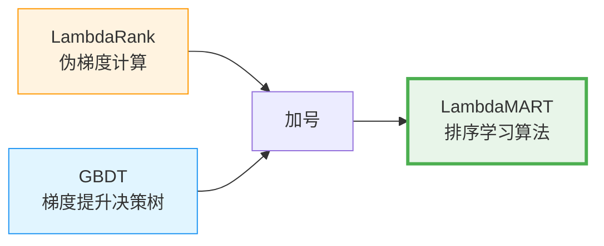
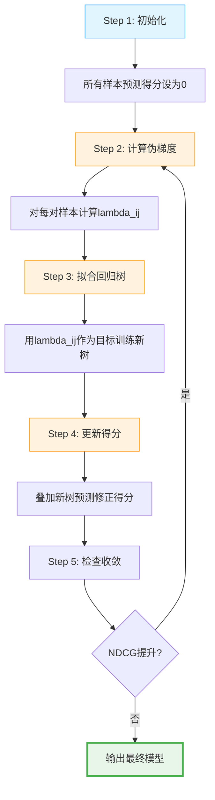
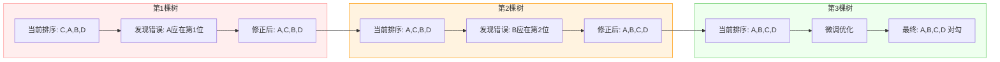
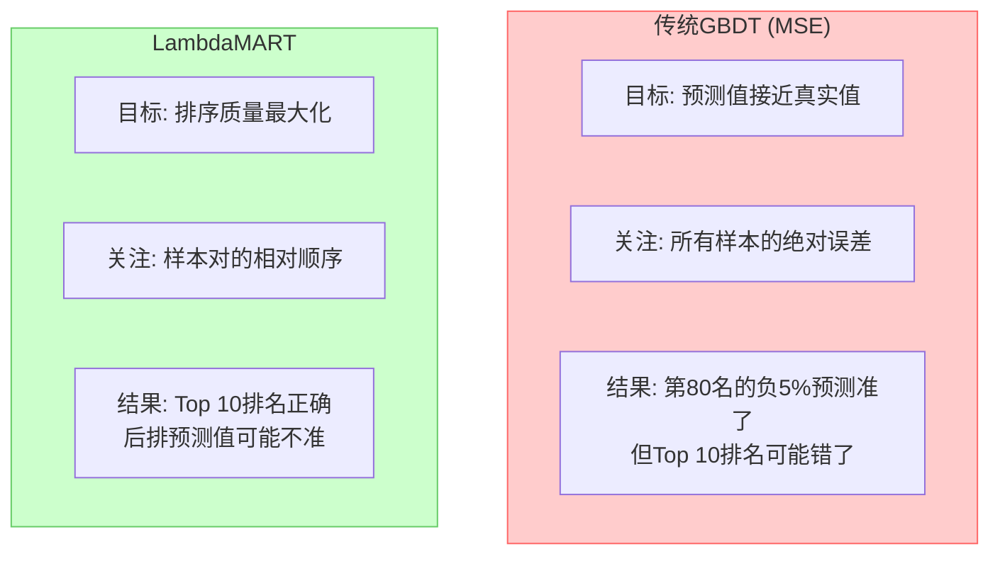

# 第12页：LambdaMART训练流程

## 图1：LambdaMART核心定义

```mermaid
graph LR
    A["LambdaRank<br/>伪梯度计算"] --> B["加号"]
    C["GBDT<br/>梯度提升决策树"] --> B
    B --> D["LambdaMART<br/>排序学习算法"]
    
    style A fill:#fff3e0,stroke:#FF9800
    style C fill:#e1f5ff,stroke:#2196F3
    style D fill:#e8f5e9,stroke:#4CAF50,stroke-width:3px
```

## 图2：5步训练流程

```mermaid
graph TD
    A["Step 1: 初始化"] --> B["所有样本预测得分设为0"]
    B --> C["Step 2: 计算伪梯度"]
    C --> D["对每对样本计算lambda_ij"]
    D --> E["Step 3: 拟合回归树"]
    E --> F["用lambda_ij作为目标训练新树"]
    F --> G["Step 4: 更新得分"]
    G --> H["叠加新树预测修正得分"]
    H --> I["Step 5: 检查收敛"]
    I --> J{"NDCG提升?"}
    J -->|是| C
    J -->|否| K["输出最终模型"]
    
    style A fill:#e1f5ff,stroke:#2196F3
    style C fill:#fff3e0,stroke:#FF9800
    style E fill:#fff3e0,stroke:#FF9800
    style G fill:#fff3e0,stroke:#FF9800
    style K fill:#e8f5e9,stroke:#4CAF50,stroke-width:3px
```

## 图3：每棵树的修正目标

```mermaid
graph LR
    subgraph 迭代1["第1棵树"]
        I1["当前排序: C,A,B,D"]
        I2["发现错误: A应在第1位"]
        I3["修正后: A,C,B,D"]
    end
    
    subgraph 迭代2["第2棵树"]
        I4["当前排序: A,C,B,D"]
        I5["发现错误: B应在第2位"]
        I6["修正后: A,B,C,D"]
    end
    
    subgraph 迭代3["第3棵树"]
        I7["当前排序: A,B,C,D"]
        I8["微调优化"]
        I9["最终: A,B,C,D 对勾"]
    end
    
    I1 --> I2 --> I3 --> I4 --> I5 --> I6 --> I7 --> I8 --> I9
    
    style 迭代1 fill:#ffeeee,stroke:#ff9999
    style 迭代2 fill:#fff3e0,stroke:#FF9800
    style 迭代3 fill:#eeffee,stroke:#66cc66
```

## 图4：与MSE的对比

```mermaid
graph TD
    subgraph MSE训练["传统GBDT (MSE)"]
        M1["目标: 预测值接近真实值"]
        M2["关注: 所有样本的绝对误差"]
        M3["结果: 第80名的负5%预测准了<br/>但Top 10排名可能错了"]
    end
    
    subgraph Lambda训练["LambdaMART"]
        L1["目标: 排序质量最大化"]
        L2["关注: 样本对的相对顺序"]
        L3["结果: Top 10排名正确<br/>后排预测值可能不准"]
    end
    
    style MSE训练 fill:#ffcccc,stroke:#ff6666
    style Lambda训练 fill:#ccffcc,stroke:#66cc66
```
