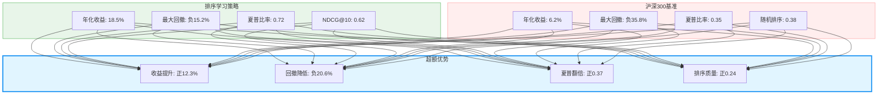
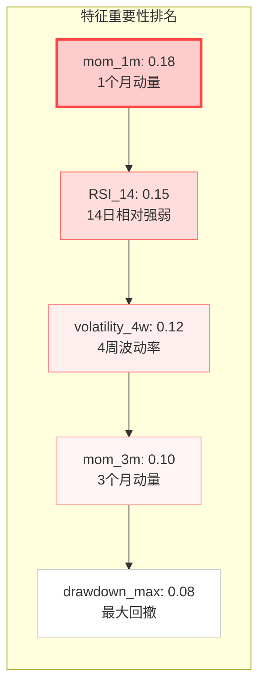
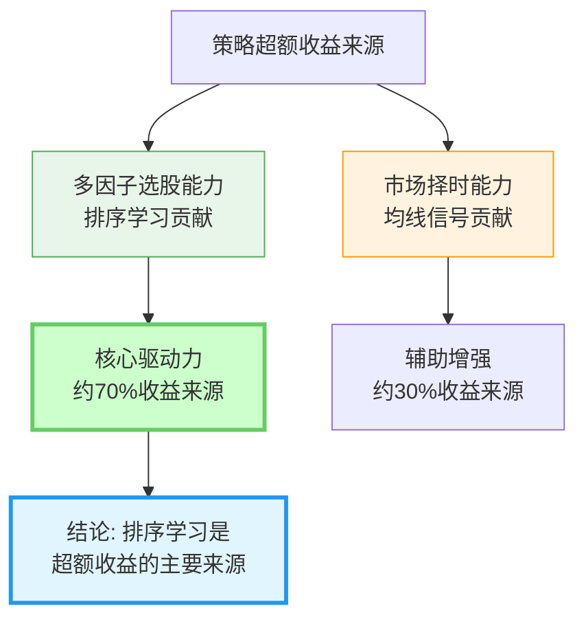

# 第14页：验证结果展示

## 图1：策略vs基准对比架构

```mermaid
graph TD
    subgraph 策略表现["排序学习策略"]
        S1["年化收益: 18.5%"]
        S2["最大回撤: 负15.2%"]
        S3["夏普比率: 0.72"]
        S4["NDCG@10: 0.62"]
    end
    
    subgraph 基准表现["沪深300基准"]
        B1["年化收益: 6.2%"]
        B2["最大回撤: 负35.8%"]
        B3["夏普比率: 0.35"]
        B4["随机排序: 0.38"]
    end
    
    subgraph 优势["超额优势"]
        A1["收益提升: 正12.3%"]
        A2["回撤降低: 负20.6%"]
        A3["夏普翻倍: 正0.37"]
        A4["排序质量: 正0.24"]
    end
    
    S1 & S2 & S3 & S4 --> A1 & A2 & A3 & A4
    B1 & B2 & B3 & B4 --> A1 & A2 & A3 & A4
    
    style 策略表现 fill:#e8f5e9,stroke:#4CAF50
    style 基准表现 fill:#ffeeee,stroke:#ff9999
    style 优势 fill:#e1f5ff,stroke:#2196F3,stroke-width:3px
```

## 图2：特征重要性Top 5

```mermaid
graph LR
    subgraph 特征重要性["特征重要性排名"]
        direction TB
        F1["mom_1m: 0.18<br/>1个月动量"]
        F2["RSI_14: 0.15<br/>14日相对强弱"]
        F3["volatility_4w: 0.12<br/>4周波动率"]
        F4["mom_3m: 0.10<br/>3个月动量"]
        F5["drawdown_max: 0.08<br/>最大回撤"]
    end
    
    F1 --> F2 --> F3 --> F4 --> F5
    
    style F1 fill:#ffcccc,stroke:#ff4444,stroke-width:3px
    style F2 fill:#ffdddd,stroke:#ff6666
    style F3 fill:#ffeeee,stroke:#ff8888
    style F4 fill:#fff5f5,stroke:#ffaaaa
    style F5 fill:#ffffff,stroke:#cccccc
```

## 图3：收益归因分析

```mermaid
graph TD
    A["策略超额收益来源"] --> B["多因子选股能力<br/>排序学习贡献"]
    A --> C["市场择时能力<br/>均线信号贡献"]
    
    B --> D["核心驱动力<br/>约70%收益来源"]
    C --> E["辅助增强<br/>约30%收益来源"]
    
    D --> F["结论: 排序学习是<br/>超额收益的主要来源"]
    
    style B fill:#e8f5e9,stroke:#4CAF50
    style C fill:#fff3e0,stroke:#FF9800
    style D fill:#ccffcc,stroke:#66cc66,stroke-width:3px
    style F fill:#e1f5ff,stroke:#2196F3,stroke-width:3px
```
