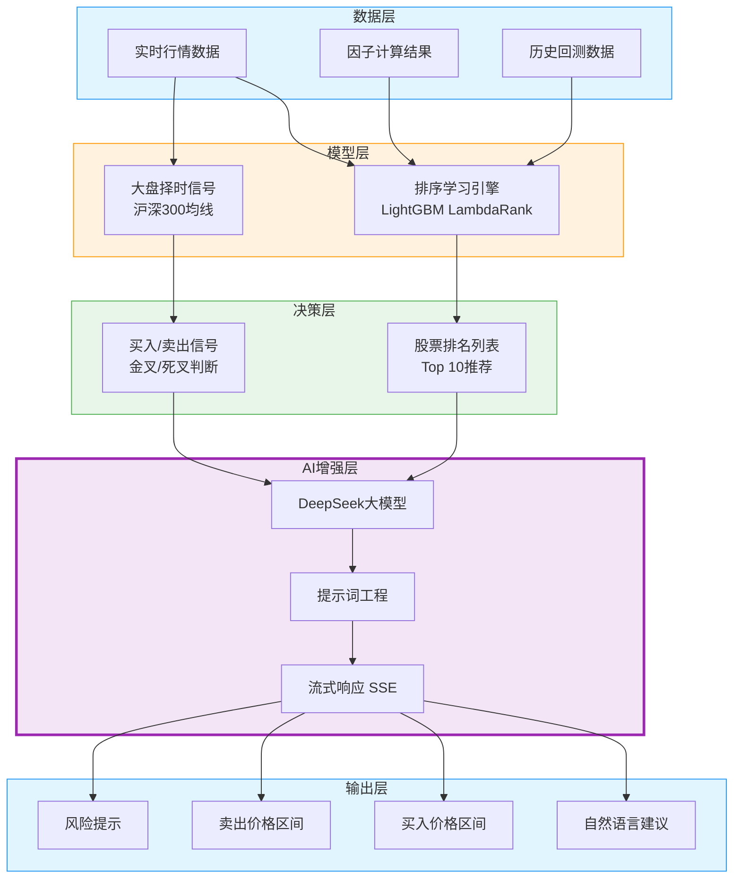
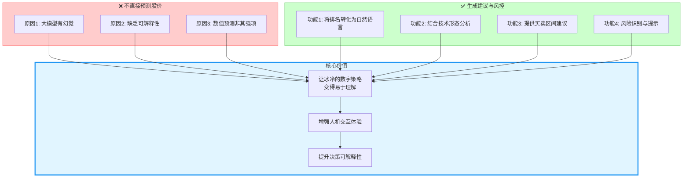
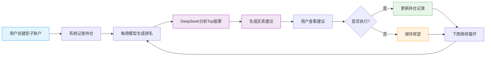

# 第15页：大模型集成架构

## 图1：系统整体架构

```mermaid
graph TD
    subgraph 数据层["数据层"]
        D1[实时行情数据]
        D2[因子计算结果]
        D3[历史回测数据]
    end
    
    subgraph 模型层["模型层"]
        M1[排序学习引擎<br/>LightGBM LambdaRank]
        M2[大盘择时信号<br/>沪深300均线]
    end
    
    subgraph 决策层["决策层"]
        P1[股票排名列表<br/>Top 10推荐]
        P2[买入/卖出信号<br/>金叉/死叉判断]
    end
    
    subgraph AI增强层["AI增强层"]
        A1[DeepSeek大模型]
        A2[提示词工程]
        A3[流式响应 SSE]
    end
    
    subgraph 输出层["输出层"]
        O1[自然语言建议]
        O2[买入价格区间]
        O3[卖出价格区间]
        O4[风险提示]
    end
    
    D1 & D2 & D3 --> M1
    D1 --> M2
    M1 --> P1
    M2 --> P2
    P1 & P2 --> A1
    A1 --> A2 --> A3
    A3 --> O1 & O2 & O3 & O4
    
    style 数据层 fill:#e1f5ff,stroke:#2196F3
    style 模型层 fill:#fff3e0,stroke:#FF9800
    style 决策层 fill:#e8f5e9,stroke:#4CAF50
    style AI增强层 fill:#f3e5f5,stroke:#9C27B0,stroke-width:3px
    style 输出层 fill:#e1f5ff,stroke:#2196F3
```

## 图2：大模型定位

```mermaid
graph TD
    subgraph 不做什么["❌ 不直接预测股价"]
        N1[原因1: 大模型有幻觉]
        N2[原因2: 缺乏可解释性]
        N3[原因3: 数值预测非其强项]
    end
    
    subgraph 做什么["✅ 生成建议与风控"]
        Y1[功能1: 将排名转化为自然语言]
        Y2[功能2: 结合技术形态分析]
        Y3[功能3: 提供买卖区间建议]
        Y4[功能4: 风险识别与提示]
    end
    
    subgraph 价值["核心价值"]
        V1[让冰冷的数字策略<br/>变得易于理解]
        V2[增强人机交互体验]
        V3[提升决策可解释性]
    end
    
    N1 & N2 & N3 --> V1
    Y1 & Y2 & Y3 & Y4 --> V1
    V1 --> V2 --> V3
    
    style 不做什么 fill:#ffcccc,stroke:#ff6666
    style 做什么 fill:#ccffcc,stroke:#66cc66
    style 价值 fill:#e1f5ff,stroke:#2196F3,stroke-width:3px
```

## 图3：影子账户流程

```mermaid
graph LR
    A[用户创建影子账户] --> B[系统记录持仓]
    B --> C[每周模型生成排名]
    C --> D[DeepSeek分析Top股票]
    D --> E[生成买卖建议]
    E --> F[用户查看建议]
    F --> G{是否执行?}
    G -->|是| H[更新持仓记录]
    G -->|否| I[保持观望]
    H & I --> J[下周继续循环]
    J --> C
    
    style A fill:#e1f5ff,stroke:#2196F3
    style D fill:#f3e5f5,stroke:#9C27B0
    style E fill:#f3e5f5,stroke:#9C27B0
    style H fill:#e8f5e9,stroke:#4CAF50
    style I fill:#fff3e0,stroke:#FF9800
```
