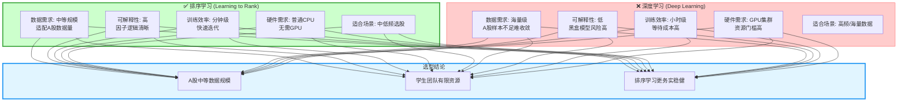
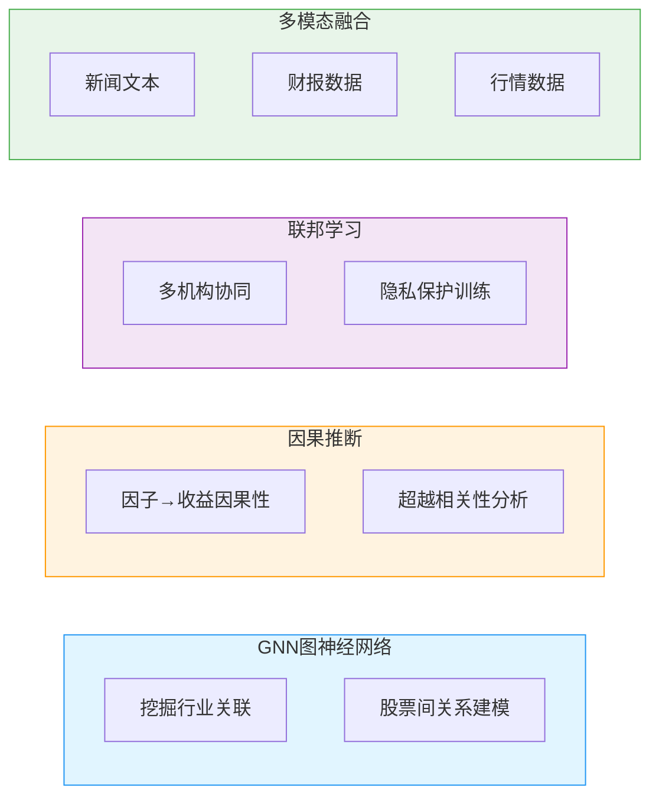

# 第16页：技术选型对比

## 图1：排序学习 vs 深度学习对比

```mermaid
graph TD
    subgraph 排序学习["✅ 排序学习 (Learning to Rank)"]
        direction TB
        L1[数据需求: 中等规模<br/>适配A股数据量]
        L2[可解释性: 高<br/>因子逻辑清晰]
        L3[训练效率: 分钟级<br/>快速迭代]
        L4[硬件需求: 普通CPU<br/>无需GPU]
        L5[适合场景: 中低频选股]
    end
    
    subgraph 深度学习["❌ 深度学习 (Deep Learning)"]
        direction TB
        D1[数据需求: 海量级<br/>A股样本不足难收敛]
        D2[可解释性: 低<br/>黑盒模型风险高]
        D3[训练效率: 小时级<br/>等待成本高]
        D4[硬件需求: GPU集群<br/>资源门槛高]
        D5[适合场景: 高频/海量数据]
    end
    
    subgraph 结论["选型结论"]
        C1[A股中等数据规模]
        C2[学生团队有限资源]
        C3[排序学习更务实稳健]
    end
    
    L1 & L2 & L3 & L4 & L5 --> C1 & C2 & C3
    D1 & D2 & D3 & D4 --> C1 & C2 & C3
    
    style 排序学习 fill:#ccffcc,stroke:#44aa44,stroke-width:3px
    style 深度学习 fill:#ffcccc,stroke:#ff6666
    style 结论 fill:#e1f5ff,stroke:#2196F3,stroke-width:3px
```

## 图2：未来优化方向

```mermaid
graph LR
    subgraph 方向1["GNN图神经网络"]
        G1[挖掘行业关联]
        G2[股票间关系建模]
    end
    
    subgraph 方向2["因果推断"]
        C1[因子→收益因果性]
        C2[超越相关性分析]
    end
    
    subgraph 方向3["联邦学习"]
        F1[多机构协同]
        F2[隐私保护训练]
    end
    
    subgraph 方向4["多模态融合"]
        M1[新闻文本]
        M2[财报数据]
        M3[行情数据]
    end
    
    style 方向1 fill:#e1f5ff,stroke:#2196F3
    style 方向2 fill:#fff3e0,stroke:#FF9800
    style 方向3 fill:#f3e5f5,stroke:#9C27B0
    style 方向4 fill:#e8f5e9,stroke:#4CAF50
```
