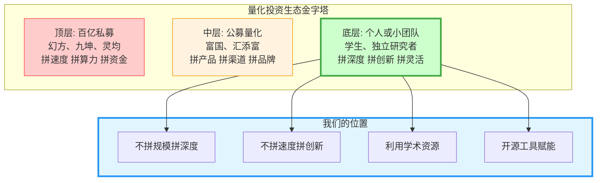
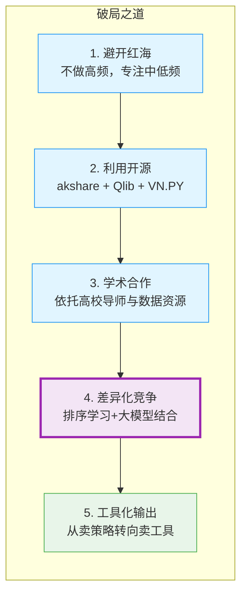
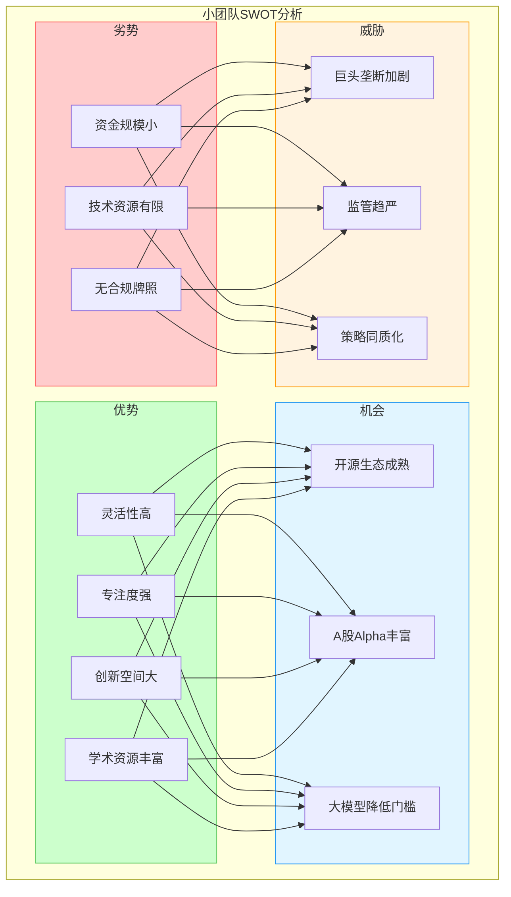

# 第17页：小团队生存策略

## 图1：量化生态金字塔

```mermaid
graph TD
    subgraph 金字塔["量化投资生态金字塔"]
        direction TB
        T1["顶层: 百亿私募<br/>幻方、九坤、灵均<br/>拼速度 拼算力 拼资金"]
        T2["中层: 公募量化<br/>富国、汇添富<br/>拼产品 拼渠道 拼品牌"]
        T3["底层: 个人或小团队<br/>学生、独立研究者<br/>拼深度 拼创新 拼灵活"]
    end
    
    subgraph 我们的位置["我们的位置"]
        P1["不拼规模拼深度"]
        P2["不拼速度拼创新"]
        P3["利用学术资源"]
        P4["开源工具赋能"]
    end
    
    T3 --> P1 & P2 & P3 & P4
    
    style T1 fill:#ffcccc,stroke:#ff4444
    style T2 fill:#fff3e0,stroke:#FF9800
    style T3 fill:#ccffcc,stroke:#44aa44,stroke-width:3px
    style 我们的位置 fill:#e1f5ff,stroke:#2196F3,stroke-width:3px
```

## 图2：五大生存策略

```mermaid
graph LR
    subgraph 策略["破局之道"]
        S1["1. 避开红海<br/>不做高频，专注中低频"]
        S2["2. 利用开源<br/>akshare + Qlib + VN.PY"]
        S3["3. 学术合作<br/>依托高校导师与数据资源"]
        S4["4. 差异化竞争<br/>排序学习+大模型结合"]
        S5["5. 工具化输出<br/>从卖策略转向卖工具"]
    end
    
    S1 --> S2 --> S3 --> S4 --> S5
    
    style S1 fill:#e1f5ff,stroke:#2196F3
    style S2 fill:#e1f5ff,stroke:#2196F3
    style S3 fill:#e1f5ff,stroke:#2196F3
    style S4 fill:#f3e5f5,stroke:#9C27B0,stroke-width:3px
    style S5 fill:#e8f5e9,stroke:#4CAF50
```

## 图3：SWOT分析

```mermaid
graph TD
    subgraph SWOT["小团队SWOT分析"]
        direction LR
        
        subgraph 优势S["优势"]
            S1["灵活性高"]
            S2["专注度强"]
            S3["创新空间大"]
            S4["学术资源丰富"]
        end
        
        subgraph 劣势W["劣势"]
            W1["资金规模小"]
            W2["技术资源有限"]
            W3["无合规牌照"]
        end
        
        subgraph 机会O["机会"]
            O1["开源生态成熟"]
            O2["A股Alpha丰富"]
            O3["大模型降低门槛"]
        end
        
        subgraph 威胁T["威胁"]
            T1["巨头垄断加剧"]
            T2["监管趋严"]
            T3["策略同质化"]
        end
    end
    
    S1 & S2 & S3 & S4 --> O1 & O2 & O3
    W1 & W2 & W3 --> T1 & T2 & T3
    
    style 优势S fill:#ccffcc,stroke:#66cc66
    style 劣势W fill:#ffcccc,stroke:#ff6666
    style 机会O fill:#e1f5ff,stroke:#2196F3
    style 威胁T fill:#fff3e0,stroke:#FF9800
```
