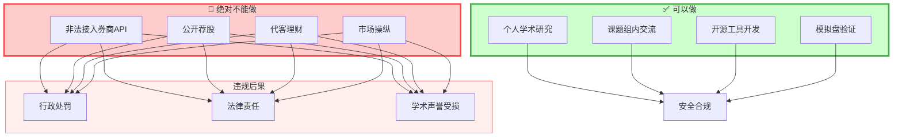
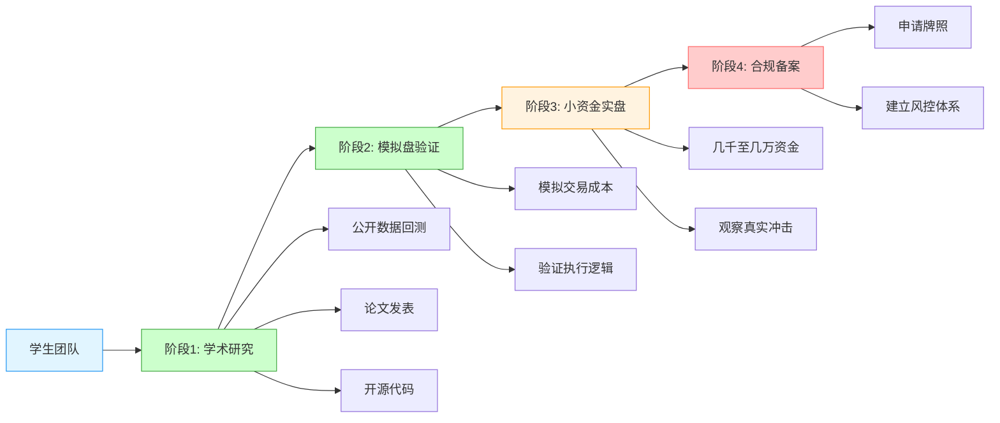

# 第18页：合规边界

## 图1：红线与可行路径

```mermaid
graph TD
    subgraph 红线["🚫 绝对不能做"]
        direction TB
        R1[非法接入券商API]
        R2[公开荐股]
        R3[代客理财]
        R4[市场操纵]
    end
    
    subgraph 可行["✅ 可以做"]
        direction TB
        F1[个人学术研究]
        F2[课题组内交流]
        F3[开源工具开发]
        F4[模拟盘验证]
    end
    
    subgraph 后果["违规后果"]
        C1[行政处罚]
        C2[法律责任]
        C3[学术声誉受损]
    end
    
    R1 & R2 & R3 & R4 --> C1 & C2 & C3
    F1 & F2 & F3 & F4 --> D[安全合规]
    
    style 红线 fill:#ffcccc,stroke:#ff4444,stroke-width:3px
    style 可行 fill:#ccffcc,stroke:#44aa44,stroke-width:3px
    style 后果 fill:#ffeeee,stroke:#ff6666
```

## 图2：学生团队合规路径

```mermaid
graph LR
    A[学生团队] --> B[阶段1: 学术研究]
    B --> C[阶段2: 模拟盘验证]
    C --> D[阶段3: 小资金实盘]
    D --> E[阶段4: 合规备案]
    
    B --> B1[公开数据回测]
    B --> B2[论文发表]
    B --> B3[开源代码]
    
    C --> C1[模拟交易成本]
    C --> C2[验证执行逻辑]
    
    D --> D1[几千至几万资金]
    D --> D2[观察真实冲击]
    
    E --> E1[申请牌照]
    E --> E2[建立风控体系]
    
    style A fill:#e1f5ff,stroke:#2196F3
    style B fill:#ccffcc,stroke:#44aa44
    style C fill:#ccffcc,stroke:#44aa44
    style D fill:#fff3e0,stroke:#FF9800
    style E fill:#ffcccc,stroke:#ff6666
```
