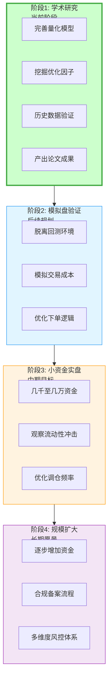
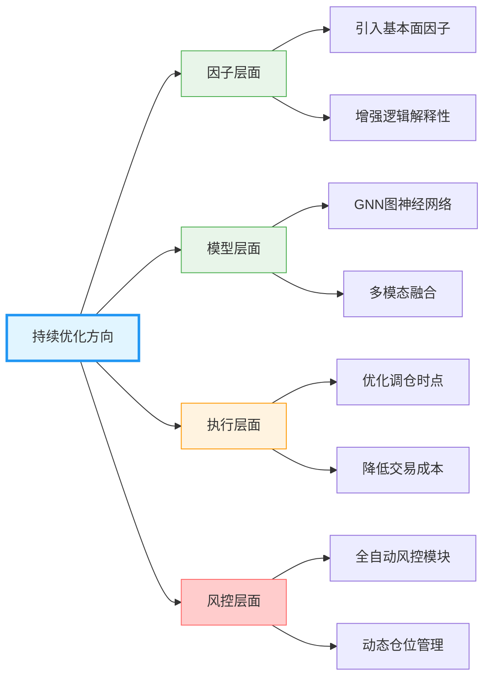

# 第19页：落地路径规划

## 图1：四阶段路径

```mermaid
graph TD
    subgraph 阶段1["阶段1: 学术研究<br/>当前阶段"]
        S1[完善量化模型]
        S2[挖掘优化因子]
        S3[历史数据验证]
        S4[产出论文成果]
    end
    
    subgraph 阶段2["阶段2: 模拟盘验证<br/>后续规划"]
        S5[脱离回测环境]
        S6[模拟交易成本]
        S7[优化下单逻辑]
    end
    
    subgraph 阶段3["阶段3: 小资金实盘<br/>中期目标"]
        S8[几千至几万资金]
        S9[观察流动性冲击]
        S10[优化调仓频率]
    end
    
    subgraph 阶段4["阶段4: 规模扩大<br/>长期愿景"]
        S11[逐步增加资金]
        S12[合规备案流程]
        S13[多维度风控体系]
    end
    
    阶段1 --> 阶段2 --> 阶段3 --> 阶段4
    
    style 阶段1 fill:#ccffcc,stroke:#44aa44,stroke-width:3px
    style 阶段2 fill:#e1f5ff,stroke:#2196F3
    style 阶段3 fill:#fff3e0,stroke:#FF9800
    style 阶段4 fill:#f3e5f5,stroke:#9C27B0
```

## 图2：持续优化方向

```mermaid
graph LR
    A[持续优化方向] --> B[因子层面]
    A --> C[模型层面]
    A --> D[执行层面]
    A --> E[风控层面]
    
    B --> B1[引入基本面因子]
    B --> B2[增强逻辑解释性]
    
    C --> C1[GNN图神经网络]
    C --> C2[多模态融合]
    
    D --> D1[优化调仓时点]
    D --> D2[降低交易成本]
    
    E --> E1[全自动风控模块]
    E --> E2[动态仓位管理]
    
    style A fill:#e1f5ff,stroke:#2196F3,stroke-width:3px
    style B fill:#e8f5e9,stroke:#4CAF50
    style C fill:#e8f5e9,stroke:#4CAF50
    style D fill:#fff3e0,stroke:#FF9800
    style E fill:#ffcccc,stroke:#ff6666
```
